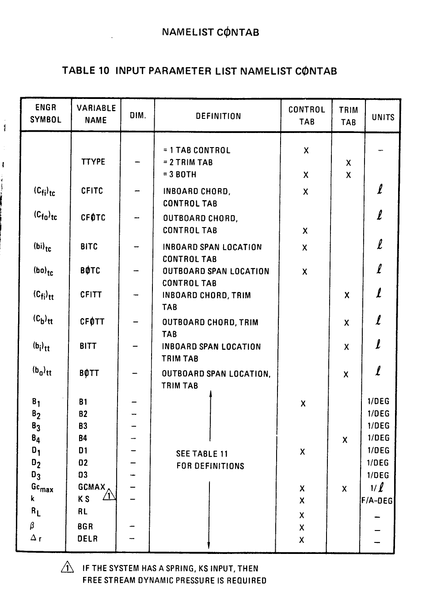
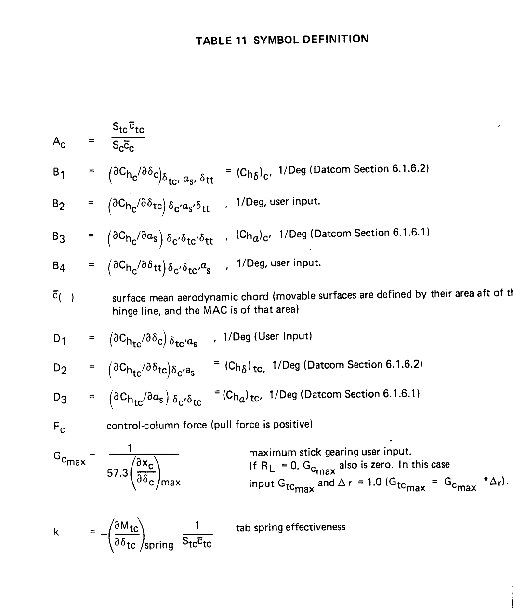
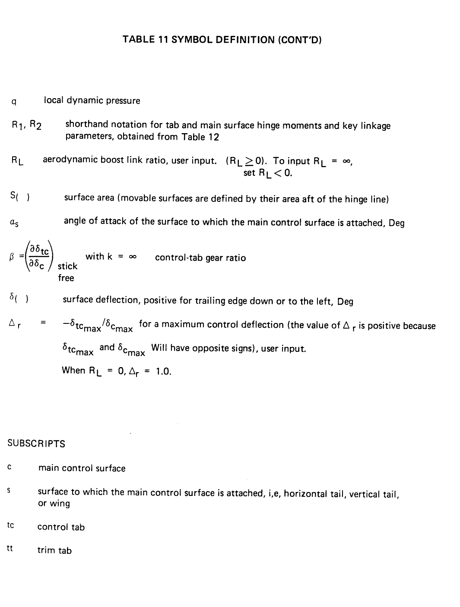

# NAMELIST CONTAB选项卡 
## 控制片和配平片的输入项

### 参数示意图
 
### 工程量含义表11
 
### 工程量含义
 
### 工程量含义表12
 

## 参数表

|        工程量        | VariableName | 别名        | 长度限制 | Definition                               | 参数说明                           |
| :---------------: | :----------: | :-------- | :--: | :--------------------------------------- | :----------------------------- |
|                   |    TTYPE     | 类型        |  0   | = 1 Tab control  =2 TRIM tab  =3 Both | = 1 控制片  =2 配平片  =3 均是 |
| $$(C_{fi})_{tc}$$ |    CFITC     | 控制片内侧弦长   |  0   | inboard chord,control tab                | 控制片内侧弦长                        |
| $$(C_{fo})_{tc}$$ |    CFOTC     | 控制片外侧弦长   |  0   | outboard chord,control tab               | 控制片外侧弦长                        |
|  $$(b_i)_{tc}$$   |     BITC     | 控制片内侧区域位置 |  0   | inboard span location control tab        | 控制片内侧区域位置                      |
|  $$(b_o)_{tc}$$   |     BOTC     | 控制片外侧区域位置 |  0   | outboard span location control tab       | 控制片外侧区域位置                      |
| $$(C_{fi})_{tt}$$ |    CFITT     | 配平片内侧弦长   |  0   | inboard chord,trim tab                   | 配平片内侧弦长                        |
| $$(C_{fo})_{tt}$$ |    CFOTT     | 配平片外侧弦长   |  0   | outboard chord,trim tab                  | 配平片外侧弦长                        |
|  $$(b_i)_{tc}$$   |     BITT     | 配平片内侧区域位置 |  0   | inboard span location trim tab           | 配平片内侧区域位置                      |
|  $$(b_o)_{tc}$$   |     BOTT     | 配平片外侧区域位置 |  0   | outboard span location trim tab          | 配平片外侧区域位置                      |
|       $B_1$       |      B1      | 见表11      |  0   | see table11 for definitions              | 见表11                           |
|       $B_2$       |      B2      | 见表11      |  0   | see table11 for definitions              | 见表11                           |
|       $B_3$       |      B3      | 见表11      |  0   | see table11 for definitions              | 见表11                           |
|       $B_4$       |      B4      | 见表11      |  0   | see table11 for definitions              | 见表11                           |
|       $D_1$       |      D1      | 见表11      |  0   | see table11 for definitions              | 见表11                           |
|       $D_2$       |      D2      | 见表11      |  0   | see table11 for definitions              | 见表11                           |
|       $D_3$       |      D3      | 见表11      |  0   | see table11 for definitions              | 见表11                           |
|   $$G_{cmax}$$    |    CGMAX     | 见表11      |  0   | see table11 for definitions              | 见表11                           |
|         k         |      KS      | 见表11      |  0   | see table11 for definitions              | 见表11                           |
|       $R_l$       |      RL      | 见表11      |  0   | see table11 for definitions              | 见表11                           |
|      $\beta$      |     BGR      | 见表11      |  0   | see table11 for definitions              | 见表11                           |
|    $\Delta_r$     |     DELR     | 见表11      |  0   | see table11 for definitions              | 见表11                           |

## Tips1 ：

KS . if the system has a spring ,KS input ,then free stream dynamic pressure is required.

如果输入中有KS这个字符串，则必须输入自由流动压.

# 分析表格的具体内容

### 1 $A_C$

$$ A_c=\frac{S_\text{tc}\overline{C}_\text{tc}}{S_c\overline{C}_c}$$

**其中：**

 $S()$表示表面积 ，可动表面积定义为铰链之后的面积.surface area （movable surface are defined by their area aft of the hinge line）

 $\overline{C}()$表示表面平均气动弦长，可动表面定义铰链之后的面积，用$MAC$表示;

 surface mean aerodynamic chord (movable surfaces are defined by their area aft of the hinge line,and the MAC is of that area )

**下标含义：**

$c$ 	表示主控制面 main control surface

$s$	表示主控制面 附属的面 ，例如平尾、垂尾、机翼. 

 surface to which the main control surface is attached，i，e，horizontal tail，vertical tail or wing。

$t_c$  	控制片 control tab

$t_t$  	配平片 trim tab

###  2. $B_1$

$$B_1 = \left ( \frac{\partial C_{h_c}}{\partial \delta _{c}} \right )_{\delta _{tc},a_s,\delta _{tt}}   = \left ( C _{h _{\delta} } \right )_{{c}'} ，  1/Deg$$

参见 6.1.6.2章 (Datcom Section 6.1.6.2)

## 3. $B_2$

$$B_2 = \left ( \frac{\partial C_{h_c}}{\partial \delta _{tc}} \right )_{\delta _{{c}'{a_s}'},\delta _{tt}}    ,1/Deg$$

用户输入 。user input                   

##  4. $B_3$

$$B_3 = \left ( \frac{\partial C _{h_c}}{\partial \delta _{a_{s}}} \right ) _{\delta _{{c}'} \delta _{t{c}'} \delta _{tt}}    = \left ( C _{h _{a } }\right )_{{c}'}$$

参见 6.1.6.1章 (Datcom Section 6.1.6.1)

## 5. $B_4$

$$B_4 = \left ( \frac{\partial C _{h_c}}{\partial \delta _{tt}} \right ) _{\delta _{{c}'} \delta _{t{c}'} a_s} $$  ,$$1/Deg$$

用户输入 。user input   

## 6. $F_c$  

$F_c$      控制柱力(拉力为正)  control-column force (pull force is positive) 

## 7.  $G_{c_{max}}$

$$G _{c _{max}} =\frac {1}{57.3\left ( \frac{\partial x_c}{\partial \delta _c} \right )_{max}}$$

maximum stick gearing user input. 

if $R_L$=0,$G_{c _{max}}$ also is zero.

In this case input $G_{tc_{max}}$ and $\Delta r = 1.0 ( G_{tc_{max}} = G_{c_{max}} * \Delta r )$ .

## 8. K

$k = -\left ( \frac{\partial M _{tc}}{\partial \delta  _{tc}} \right ) _{spring} \frac{1}{S _{tc} \overline c_{tc}}$   tab spring effectiveness

$q$  local dynamic pressure

### 9.  $R_1,R_2$

shorthand notation for tab and main surface hinge moments and key linkage parameters,obtained from Table 12 

###  10.  $R_L$ 

aerodynamic boost link ratio ,user input . $$(R_L \ge 0)$$ .

 To input $R_L = \infty $ , set $R_L <  0$ .

### 11.  $a_s$

angle of attack of the surface to which the main control surface is attached, Deg

附加控制面的曲面的攻角，Deg

###12.  $\beta$

$$ \beta = \left ( \frac{\partial \delta _{tc}}{\partial \delta _{c}} \right ) _{\begin{matrix}stick\\ free \end{matrix}}$$

 with $k = \infty$  control-tab gear ratio

