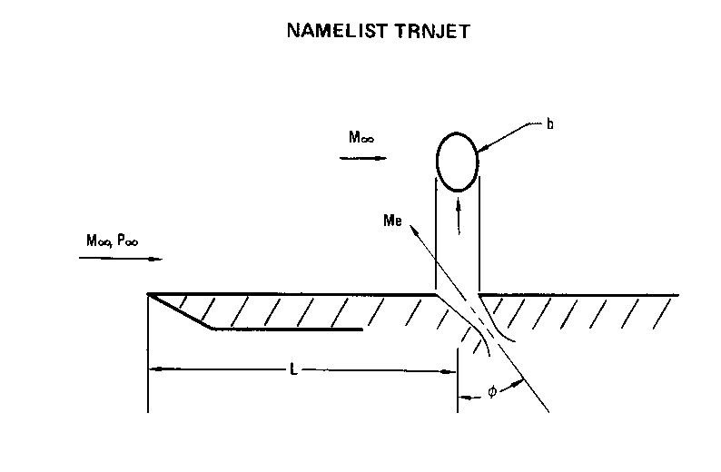
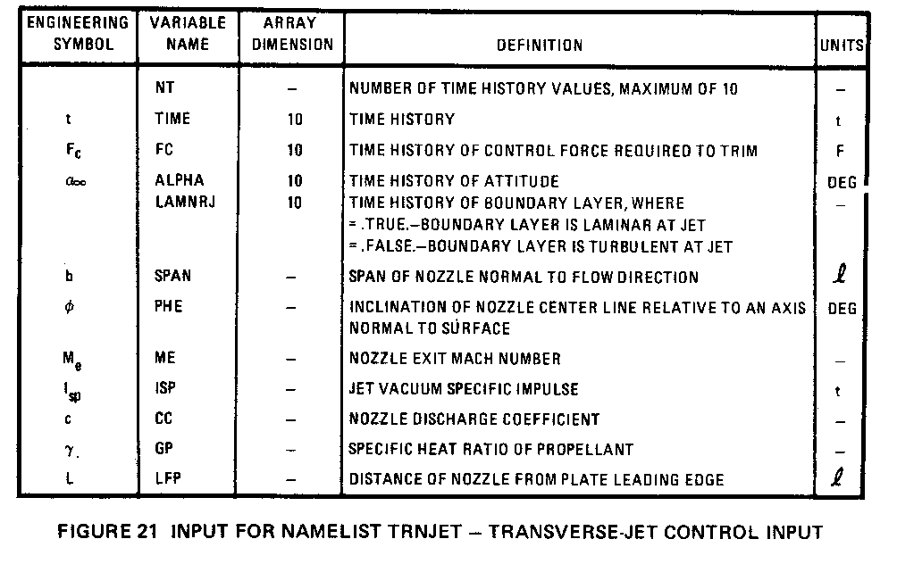

# NAMELIST TRNJET选项卡 
##  transverse-jet control input  横向喷流控制装置的输入项
Input for NAMELIST TRNJET

### 参数示意图
 

### 参数表
 

## 参数表

|工程量   | VariableName|别名|长度限制| Definition|参数说明|
|:-------:|:-------:|:----------------------------|:-:|:-----------------------------------------------------------|:------------------------------------------|
|           | NT     |   时间历程值的个数            | 0  | number of time history values,maximum of 10 | 时间历史值的个数 |
| t         | TIME   |   时间历程                    | 10 | time history     |  时间历史                  |
| $F_c$   | FC     |   配平所需的控制力的时间历程  | 10 | time history of control force required to trim      | 配平所需的控制力的时间历程        |
| $α_∞$    | ALPHA  |   姿态的时间历程              | 10 | time history of attitude      | 姿态的时间历程        |
|           | LAMNRJ |   边界层时间历程              | 10 | time history of boundary layer,where  =.TRUE. -Boundary layer is laminar at jet  =.FALSE. -Boundary layer is turbulent at jet |  边界层时间历程,当  =.TRUE. -层流边界层  =.FALSE. -湍流边界层      |
| b         | SPAN   |   流向的喷嘴宽度              | 0  | span of nozzle normal to flow direction  | 来流方向的喷嘴宽度      |
| ø         | PHE    |   喷嘴中心线相对于表面法线的倾斜角  | 0 | inclination of nozzle center line relative to an axis normal to surface | 喷嘴中心线相对于表面法线的倾斜角     |
| Me        | ME     |   喷嘴出口马赫数           | 0 | nozzle exit mach number   | 喷嘴出口马赫数       |
| $I_{sp}$ | ISP    |   射流真空比冲             | 0 | jet vacuum specific impulse    | 射流真空比冲       |
| c         | CC     |   喷嘴流量系数             | 0 | nozzle discharge coefficient   | 喷嘴流量系数      |
| γ         | GP     |   推进剂比热容比           | 0 | specific heat ratio of propellant   | 推进剂比热容比     |
| L         | LFP    |   喷嘴前缘距               | 0 | distance of nozzle from plate leading edge   | 喷嘴前缘距    |

