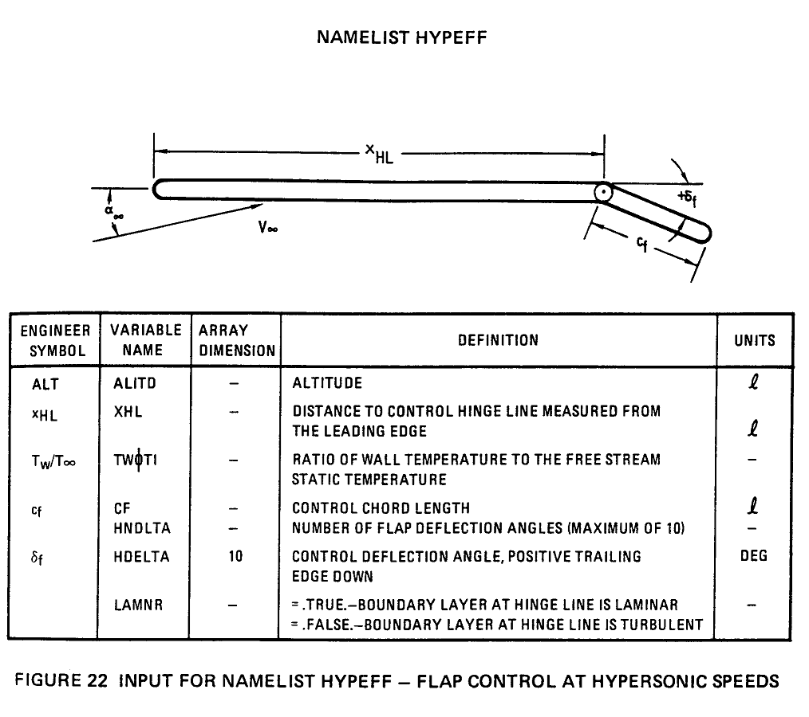

# NAMELIST HYPEFF 选项卡 
## 高超声速襟翼控制装置的输入项
 Input for NAMELIST TRNJET -flap control at hypersonic speeds 
 
### 参数示意图
 
 

## 参数表

|工程量   | VariableName|别名|长度限制| Definition|参数说明|
|:-------:|:-------:|:----------------------------|:--:|:-----------------------------------------------------------|:------------------------------------------|
| ALT     | ALITD   |  高度                       | 0  | altitude | 高度 |          
| xHL     | XHL     |  铰链到前缘的距离           | 0  | distance to control hinge line measured from the leading edge   | 铰链到前缘的距离                  |
| Tw/T∞   | TWOTI   |  壁温与自由流静态温度之比   | 0  | ratio of wall temperature to the free stream static temperature | 壁温与自由流静态温度之比        | 
| Cf      | CF      |  控制装置弦长               | 0  | control chord length      | 控制装置弦长        | 
|         | HNDLTA  |  襟翼偏转角数量             | 0  | number of flap deflection angles （maximum of 10） |  襟翼偏转角数量     | 
| δf      | HDELTA  |  控制偏角                   | 10 | control deflection angle,positive trailing edge down  | 控制偏角，后沿向下为正      |
|         | LAMNR   |  边界层类型                 | 0  |  =.TRUE. -boundary layer at hinge line is laminar  =.FALSE. -boundary layer at hinge line is turbulent |  =.TRUE. 层流边界层  =.FALSE. 湍流边界层   |

