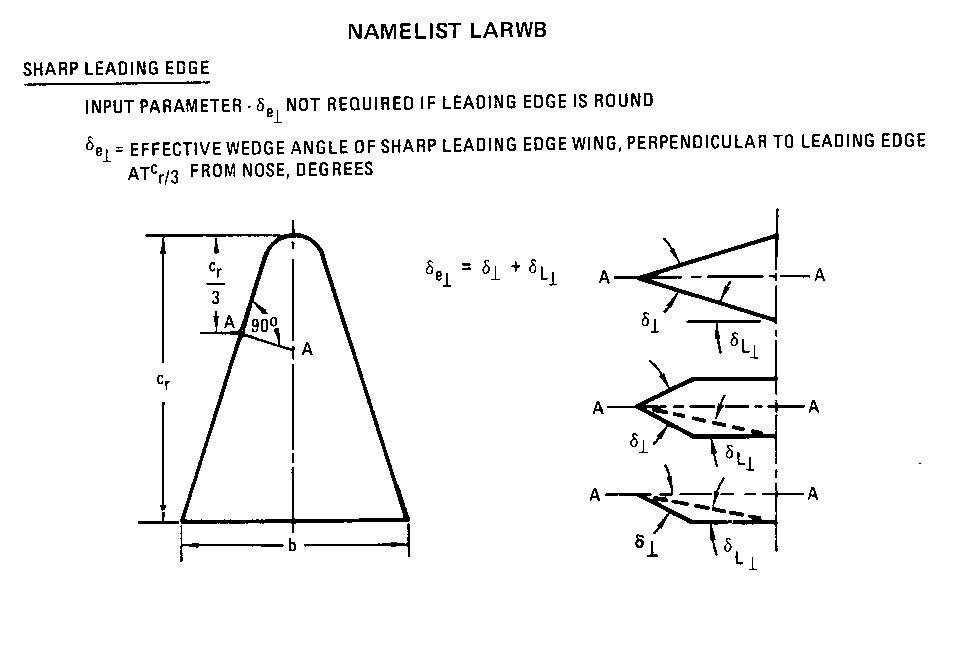
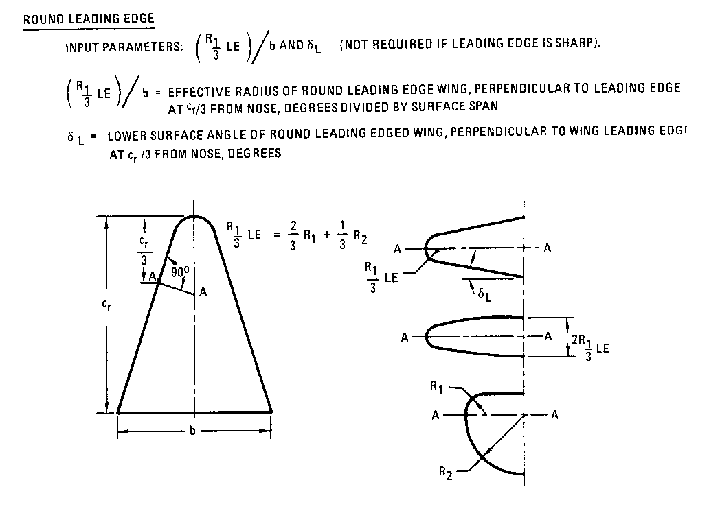
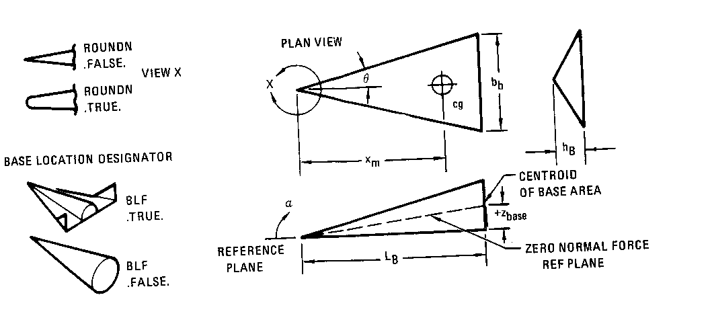
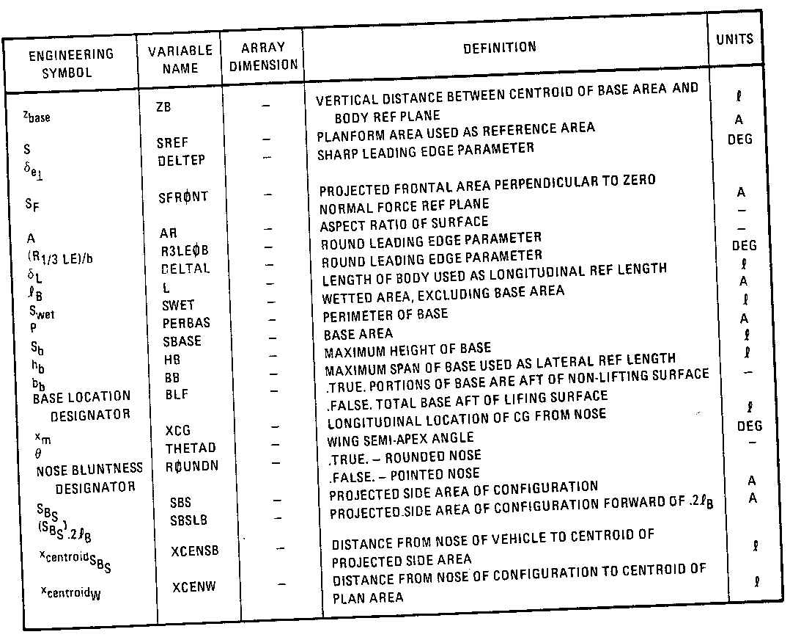

# NAMELIST LARWB 选项卡 
## Input for NAMELIST LARWB - low aspect ratio wing ,wing-body input
## LARWB输入项:低翼弦比机翼，翼身融合体

### Sharp leading edge 示意图
 
 
### Round leading edge 示意图
 
 
### 其他参数示意图
 
 
 
## 参数表

|工程量   | VariableName|别名|长度限制| Definition|参数说明|
|:-------:|:-------:|:----------------------------|:-:|:-----------------------------------------------------------|:------------------------------------------|
| Zbase   | ZB      |   质心垂直距离              | 0 | vertical distance between centroid of base area and body ref plane | 基准面质心和机体参考屏幕间的垂直距离 |          
| S       | SREF    |   平面面积                  | 0 | planform area used as reference area      |  平面面积，用作参考面积                  |
| δe⊥    | DELTEP  |   尖前缘参数                | 0 | sharp leading edge parameter              |  尖锐前缘参数                  |
| Sf      | SFRONT  |   最大投影截面积(0法向力)   | 0 | projected frontal area perpendicular to zero normal force ref plane        | 垂直于零法向力参考面的投影最大截面积                  |
| A       | AR      |   表面纵横比                | 0 | aspect ratio of surface                | 表面纵横比                  |
| (R1/3 LE)/b   | R3LEOB   |   圆前缘参数         | 0 | round leading edge parameter           | 圆前缘参数                  |
| δL      | DELTAL  |   圆前缘参数                | 0 | round leading edge parameter           | 圆前缘参数                  |
| LB      | L       |   机身长度                  | 0 | length of body used as longitudinal ref length           | 机身长度，用作纵向参考长度               |
| Swet    | SWET    |   湿区                      | 0 | wetted area，excluding base area       | 湿区，不包括基区               |
| P       | PERBAS  |   基底周长                  | 0 | perimeter of base                      | 基底周长               |
| Sb      | SBASE   |   基底面积                  | 0 | base area                              | 基底面积               |
| hb      | HB      |   基底最大高度              | 0 | maximum height of base                 | 基底最大高度               |
| bb      | BB      |   基底最大宽度              | 0 | maximum span of base used as lateral ref length                | 基底最大宽度，用作横向参考长度               |
| BASE loaction designator   | BLF      |   底部与升力面关系              | 0 | .TRUE. Portions of base are aft of NON-lifting surface   .FALSE. Total base aft of lifing surface      | .TRUE. 部分底部在非升力面的后部   .FALSE. 整个底部在升力面后部             |
| Xm      | XCG     |   重心纵向距离              | 0 | longitudinal location of CG from nose                 | 重心纵向距离，从机头起算               |
| θ       | THETAD  |   机翼半顶角                | 0 | wing semi-apex angle                   | 机翼半顶角               |
| NOSE bluntness designator       | ROUNDN  |   鼻型                | 0 | .TRUE. rounded nose   .FALSE. pointed nose      | .TRUE. 圆鼻   .FALSE. 尖鼻             |
| Sbs     | SBS     |   投影侧面积                | 0 | projected side area of configuration                    | 构型的投影侧面积               |
| (SBS).2LB   | SBSLB     |   前20%机身的投影侧面积        | 0 | projected side area of configuration forward of .2LB               | 前20%机身的投影侧面积               |
| XcentroidSBS  | XCENSB  |   投影侧面质心到机头的距离     | 0 | distance from nose of vehicle to centroid of projected side area   | 从飞行器鼻部到投影侧面积质心的距离               |
| XcentroidW    | XCENW   |   投影平面质心到构型鼻部的距离 | 0 | distance from nose of configuration to centroid of projected plain area   | 从构型鼻部到投影平面区域质心的距离               |

### 参数表
 
 

